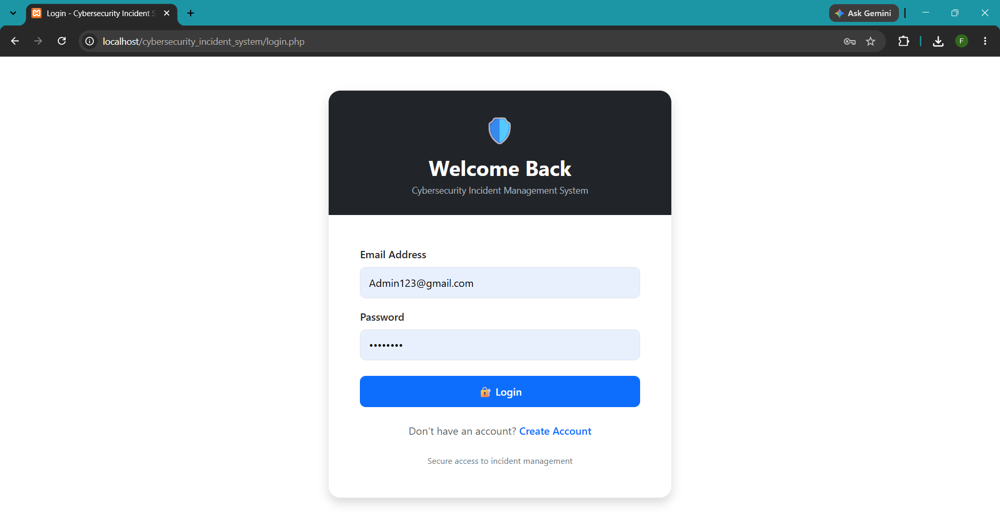
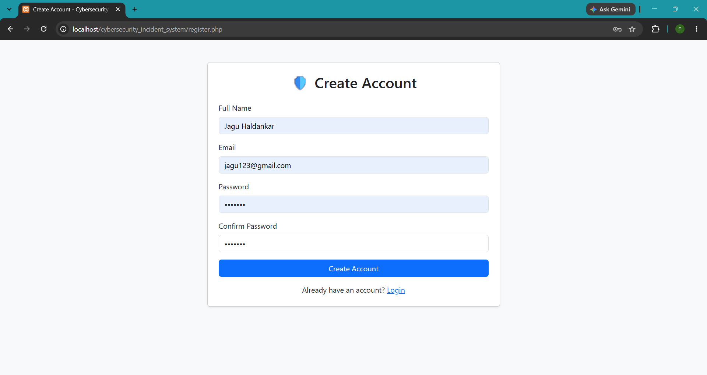
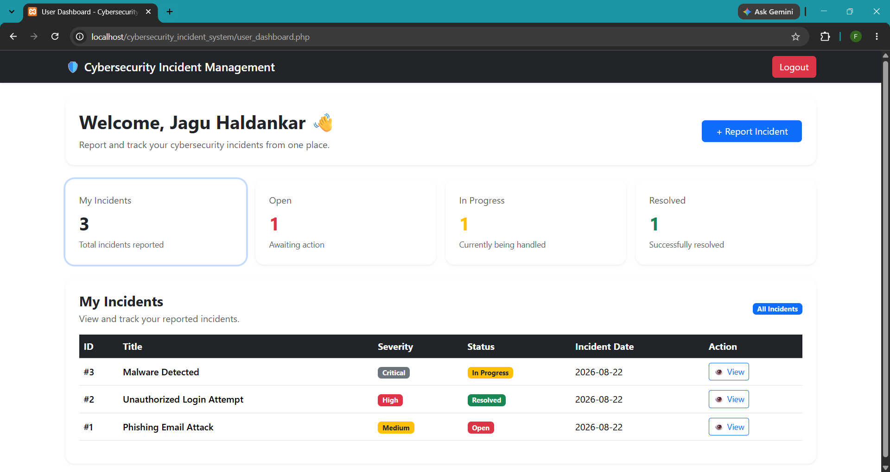
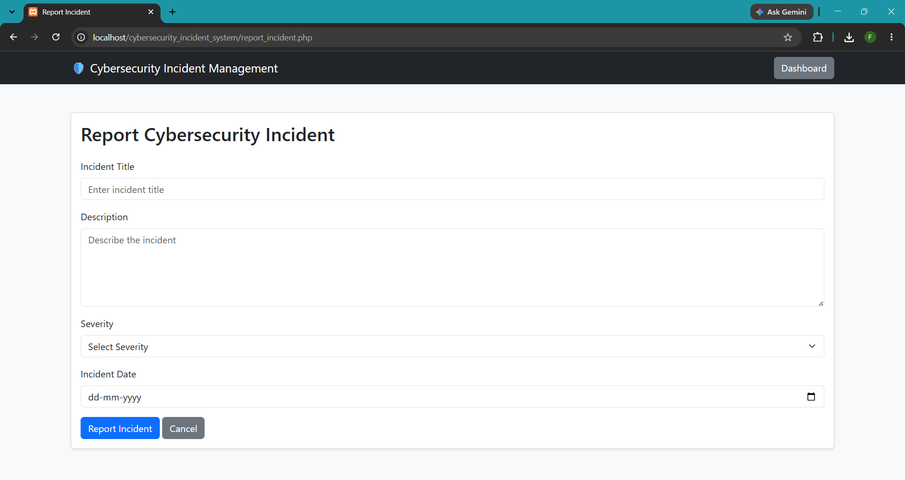
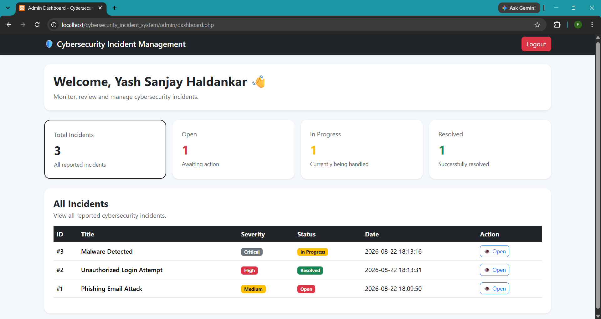

 Cybersecurity Incident Reporting & Management System

A web-based application for reporting, tracking, and managing cybersecurity incidents. The system provides separate user and administrator workflows with role-based access control and incident status tracking.

## 📌 Overview

The Cybersecurity Incident Reporting & Management System is designed to provide a simple platform where users can report cybersecurity incidents and monitor their progress.

Administrators can review reported incidents, view reporter information, update incident status, and add administrative remarks.

This project was developed individually as a BSc IT academic project to gain practical experience in web development, database management, authentication, authorization, and basic application security.

## 🎯 Objectives

- Provide a centralized platform for reporting cybersecurity incidents.
- Allow users to securely submit and track their incidents.
- Allow administrators to review and manage reported incidents.
- Implement role-based access control for different types of users.
- Store incident and user information in a MySQL database.
- Apply basic security practices during application development.

## ✨ Features

### 👤 User Features

- Create a user account
- User login and logout
- Report cybersecurity incidents
- View their own reported incidents
- View individual incident details
- Track incident status
- View incident and report dates
- Filter incidents by status
- View updates made by administrators

### 🛡️ Administrator Features

- Administrator authentication
- Admin dashboard
- View incident statistics
- View recent incidents
- Review incident details
- View reporter information
- Update incident status
- Add administrative remarks
- Filter incidents by status

## 🔐 Security Features

The project implements several basic application security practices:

- Password hashing using PHP password hashing functions.
- Prepared statements for database queries.
- Role-based authorization using sessions.
- Session-based access checks for protected pages.
- Users can access only their own incident records.
- Output escaping using `htmlspecialchars()` where appropriate.
- Database configuration is separated from application pages.
- Administrator and user workflows are separated.

> Note: This project demonstrates basic application security practices and is intended as an academic project. It is not designed to be used as a production incident-management platform without further security testing and hardening.

## 🧰 Technology Stack

| Category | Technologies |
|---|---|
| Frontend | HTML5, CSS3, Bootstrap 5, JavaScript |
| Backend | PHP |
| Database | MySQL |
| Local Server | XAMPP |
| Version Control | Git, GitHub |

## 🗂️ Project Structure

```text
cybersecurity_incident_system/
│
├── admin/
│   ├── dashboard.php
│   └── view_incident.php
│
├── assets/
│   ├── css/
│   └── js/
│
├── includes/
│   └── config.php
│
├── index.php
├── login.php
├── logout.php
├── register.php
├── report_incident.php
├── user_dashboard.php
├── view_incident.php
├── .gitignore
└── README.md
```

## 🗄️ Database

### Database Name

```text
cybersecurity_incidents
```

### Main Tables

#### `users`

Stores user and administrator account information.

Typical information includes:

- User ID
- Name
- Email
- Password
- Role
- Account creation date

#### `incidents`

Stores reported cybersecurity incidents.

Information includes:

- Incident ID
- Incident title
- Description
- Severity
- Status
- Reporter
- Incident date
- Report date
- Administrative remarks

## 🔄 Application Workflow

```text
                    ┌─────────────────┐
                    │ User Registration│
                    └────────┬────────┘
                             ↓
                    ┌─────────────────┐
                    │    User Login   │
                    └────────┬────────┘
                             ↓
                    ┌─────────────────┐
                    │ Report Incident │
                    └────────┬────────┘
                             ↓
                    ┌─────────────────┐
                    │ Track Incident  │
                    └────────┬────────┘
                             ↓
                    ┌─────────────────┐
                    │ Admin Reviews   │
                    │    Incident     │
                    └────────┬────────┘
                             ↓
                    ┌─────────────────┐
                    │ Admin Updates   │
                    │ Status/Remarks  │
                    └────────┬────────┘
                             ↓
                    ┌─────────────────┐
                    │ User Views      │
                    │ Updated Status  │
                    └─────────────────┘
```

## 📊 Incident Status

Each incident can have one of the following statuses:

- **Open** — Incident has been reported and is awaiting action.
- **In Progress** — Administrator is reviewing or working on the incident.
- **Resolved** — The incident has been addressed.

## ⚙️ Installation & Setup

### Requirements

Before running the project, install:

- XAMPP
- Apache
- MySQL
- PHP
- Web browser

### Step 1 — Clone the Repository

Clone the repository into the XAMPP `htdocs` directory.

```bash
git clone https://github.com/yash26761/cybersecurity-incident-management-system.git
```

Or download the repository as a ZIP file and extract it into:

```text
C:\xampp\htdocs\
```

### Step 2 — Start XAMPP

Open XAMPP Control Panel and start:

```text
Apache
MySQL
```

### Step 3 — Create the Database

Open phpMyAdmin:

```text
http://localhost/phpmyadmin
```

Create a database named:

```text
cybersecurity_incidents
```

Import the required database tables if a `database.sql` file is provided with the project.

### Step 4 — Configure Database Connection

Open:

```text
includes/config.php
```

Configure the database connection according to your local MySQL setup.

Example:

```php
$host = "localhost";
$username = "root";
$password = "";
$database = "cybersecurity_incidents";
```

> Update the values according to your local XAMPP/MySQL configuration.

### Step 5 — Run the Application

Open the project in your browser:

```text
http://localhost/cybersecurity_incident_system/
```

### Step 6 — Test the Application

1. Register a normal user.
2. Log in using the user account.
3. Submit a cybersecurity incident.
4. Log in as an administrator.
5. Review the reported incident.
6. Update the incident status.
7. Add administrative remarks.
8. Log back in as the user.
9. Verify that the updated incident status is displayed.

## 🧪 Testing

The following workflows can be tested:

### User Testing

- Registration
- Login
- Logout
- Incident reporting
- Viewing incidents
- Viewing incident details
- Status filtering
- Unauthorized page access

### Administrator Testing

- Admin login
- Dashboard statistics
- Incident listing
- Incident details
- Status updates
- Administrative remarks
- Status filtering

### Security Testing

- Authentication checks
- Authorization checks
- Session validation
- User-specific incident access
- Prepared database queries
- Password hashing
- Output escaping

## 📸 Screenshots

### Login Page


### Register Page


### User Dashboard


### Report Incident


### Admin Dashboard


## 🚀 Future Enhancements

Possible future improvements include:

- Email notifications for incident updates
- Advanced incident search and filtering
- File and evidence attachments
- Audit logging
- Advanced analytics and reports
- Password reset functionality
- Multi-factor authentication
- More detailed incident categorization
- Security event logging
- Improved input validation and security testing

## 📚 Learning Outcomes

Through this project, I gained practical experience with:

- PHP web application development
- MySQL database management
- HTML, CSS, JavaScript and Bootstrap
- User authentication
- Role-based access control
- Session management
- Secure password storage
- Prepared SQL statements
- Basic web application security
- Git and GitHub
- Local development using XAMPP

## 🔗 Repository

GitHub:

https://github.com/yash26761/cybersecurity-incident-management-system

## 👨‍💻 Author

**Yash Sanjay Haldankar**

TY BSc Information Technology  
S.I.W.S College  
University of Mumbai

## 📄 Project Type

Academic BSc IT Project

## ⚠️ Disclaimer

This project was developed for educational purposes to demonstrate basic cybersecurity incident management and application security concepts.

It should not be considered a production-ready cybersecurity incident response platform without additional security review, testing, monitoring, and hardening.
